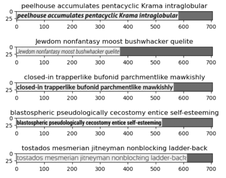
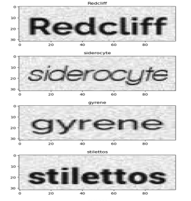
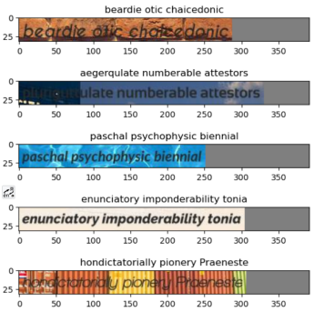

# CRNN Scene Text Tecognition

Paper： 
[An End-to-End Trainable Neural Network for Image-based Sequence Recognition and Its Application to Scene Text Recognition](http://arxiv.org/abs/1507.05717)

## Dataset

 The Datasets generated by [trdg](https://github.com/Belval/TextRecognitionDataGenerator)。

You just need to generate the training and test datasets into two different directories.

## Result

The amount of training data for all models is 10000.

| Five Words with Noise   | Single Word with Noise (trained with same Size 100x32) | Three Words with Background |
| ----------------------- | ------------------------------------------------------ | --------------------------- |
|   |                                   |       |
| Test Accuracy: 92.5%    | Test Accuracy: 93.5%                                   | Test Accuracy: 40.4%        |
| batch_size=16, epoch=30 | batch_size=32, epoch=30                                | batch_size=16, epoch=30     |

## Comment

`crnn_str_simple-ipynb` is a simple CRNN implementation that can be used with **a single word** dataset with good results.

`crnn_str.ipynb` can be used to identify text images of different lengths, and can also modify parameters to select **single channel** (grayscale image) or **three channel** (RGB color image)  for training and testing.

## Use pretrained model

The pretrained models can be downloaded by [Google Drive](https://drive.google.com/drive/folders/12qHk8XSFvcwkC8UKYrpkFznX2U0Q1drV?usp=drive_link) or [Baidu Netdisk](https://pan.baidu.com/s/1DNJ46qsmVfj5bcLQEQLxSg?pwd=nw9x) .

The document description is as follows:

| crnn_str_multi_v.pth                            | crnn_str_background.pth                                      | crnn_str_single_simple.pth                                  |
| ----------------------------------------------- | ------------------------------------------------------------ | ----------------------------------------------------------- |
| Trained by `crnn_str.ipynb` using 5-word dataset. | Trained by`crnn_str.ipynb` using 3-word dataset with background. | Trained bt `crnn_str_simple.ipynb` using single word dataset. |

## References:

[https://github.com/bgshih/crnn](https://github.com/meijieru/crnn.pytorch
)

[https://github.com/meijieru/crnn.pytorch](https://github.com/meijieru/crnn.pytorch
)
